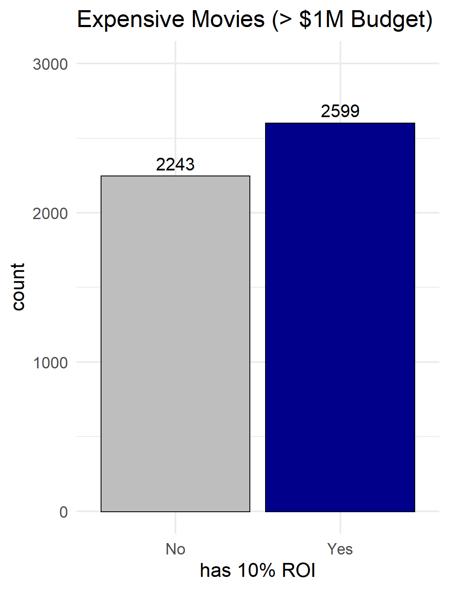
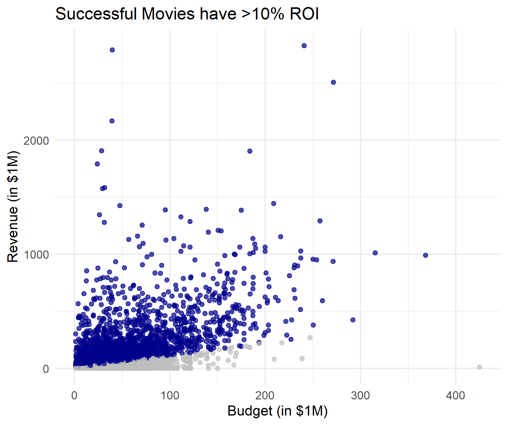
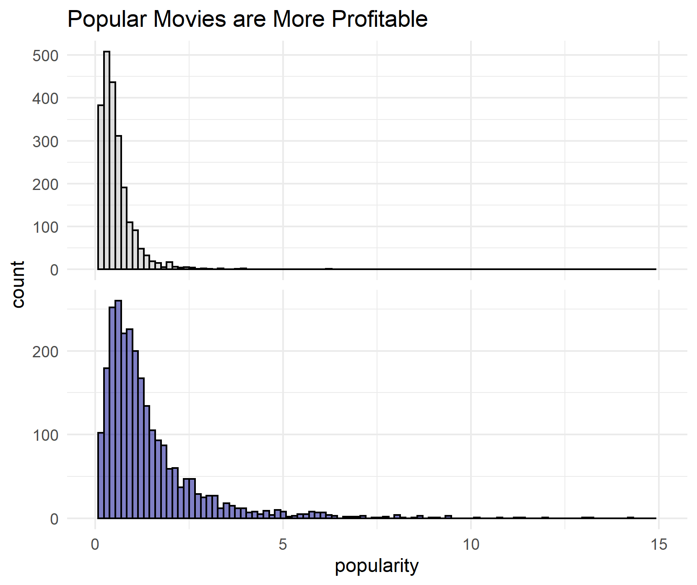
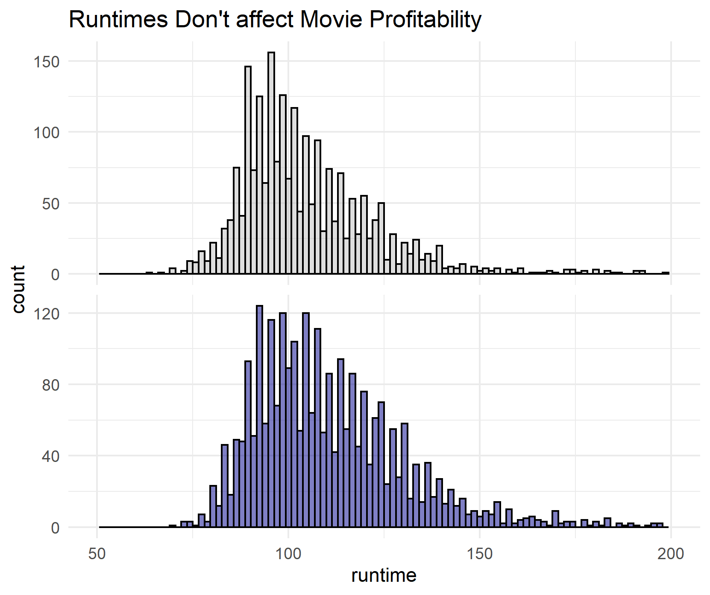
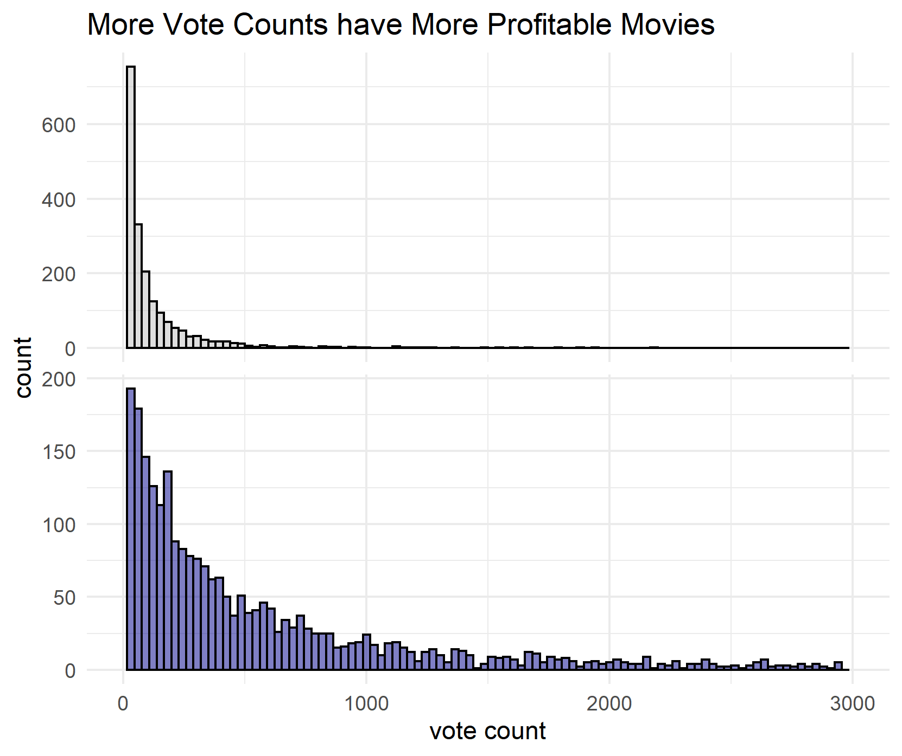
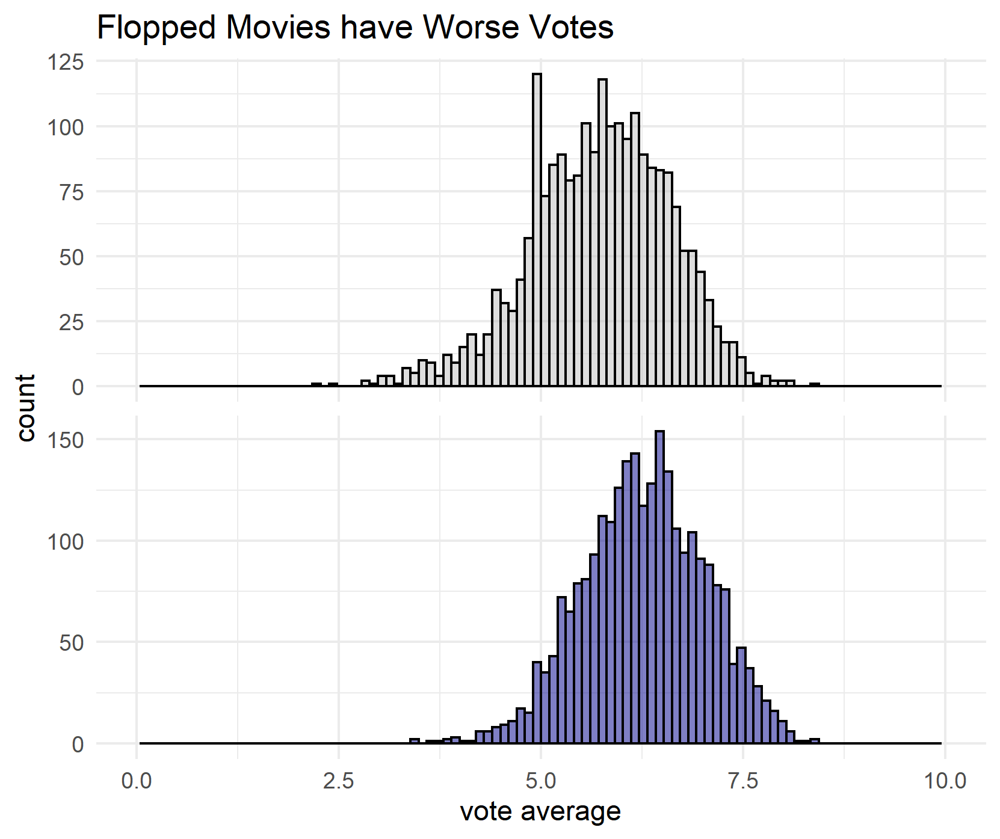
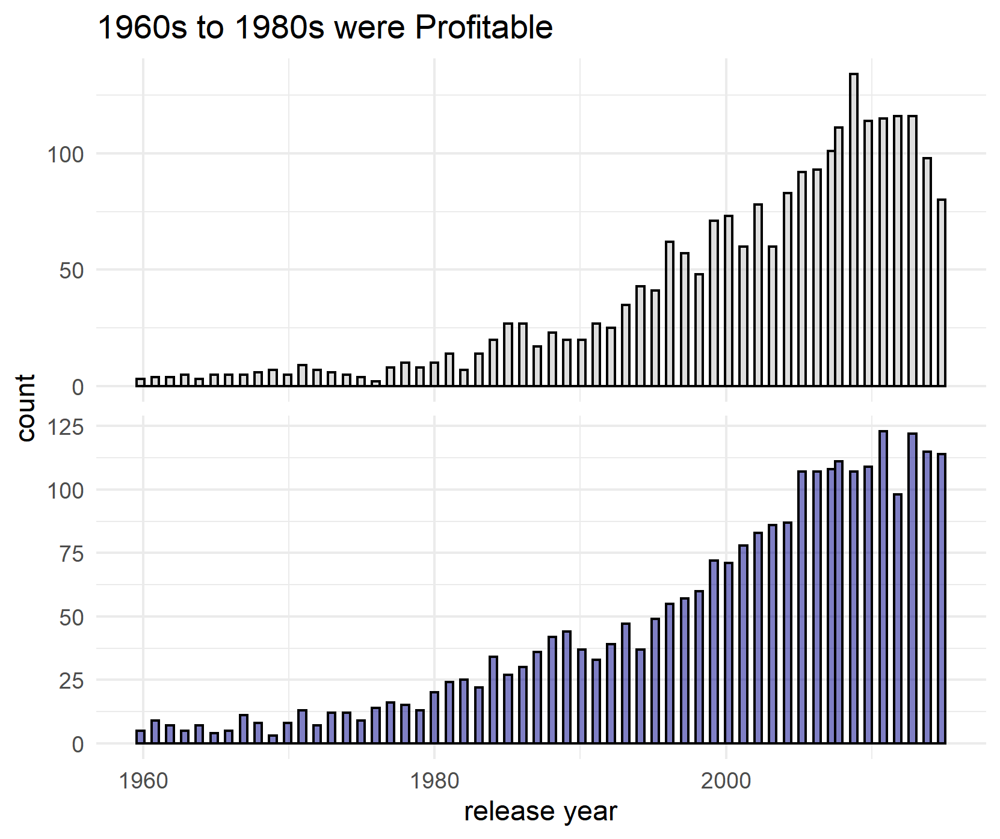
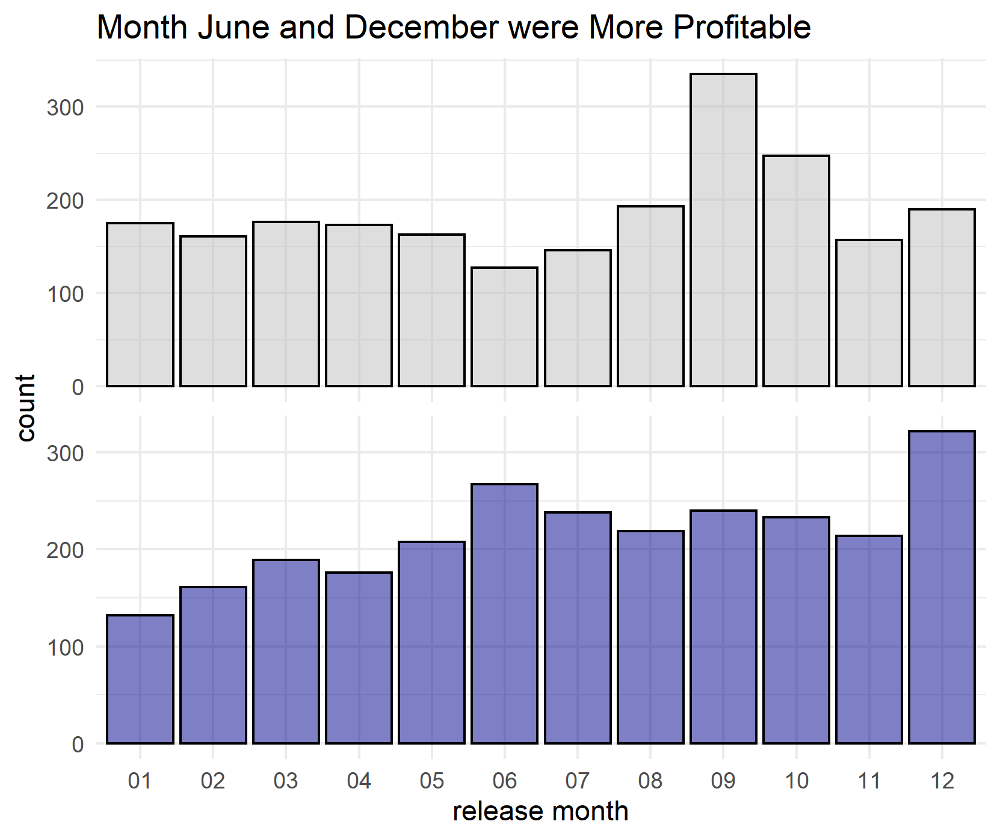
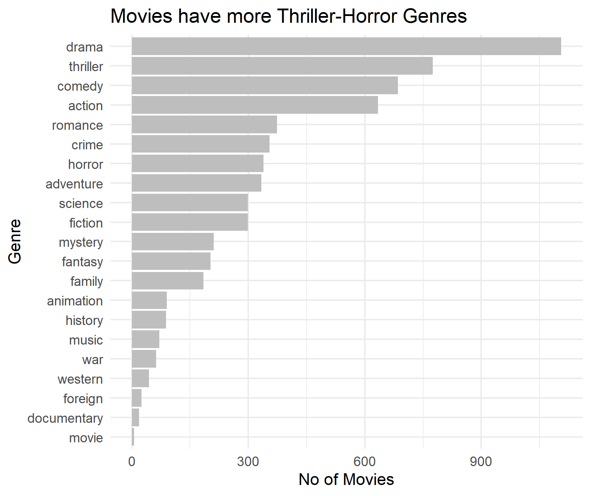
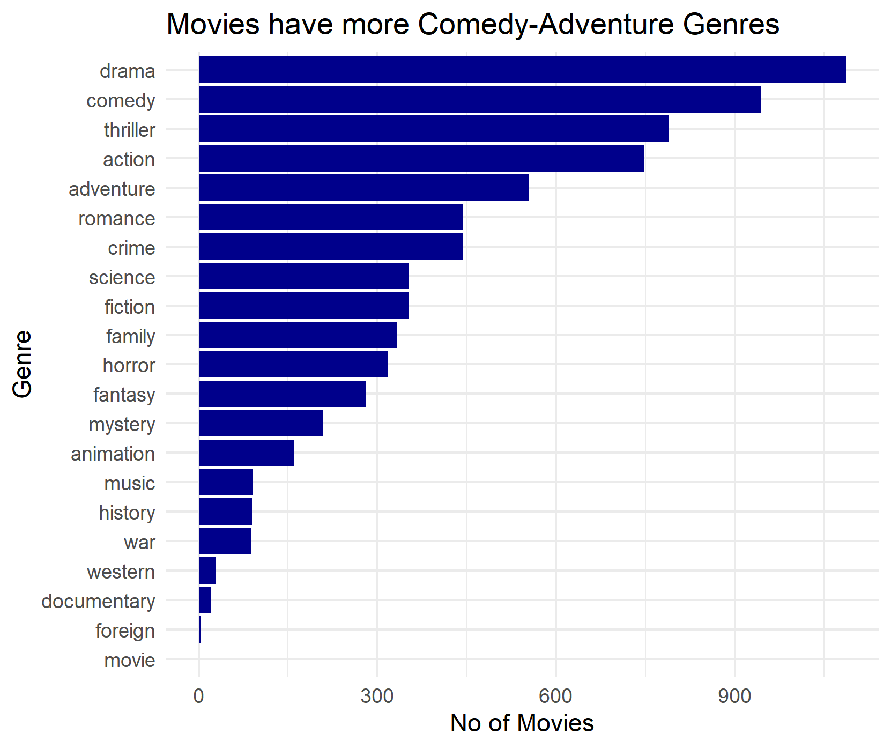

# How to Not Flop An Expensive Movie?
#### An Exploratory Data Analysis Approach on Expensive Movies  (>1M Budget) using R

Data Source: [10K IMDB Dataset](https://www.kaggle.com/juzershakir/tmdb-movies-dataset)
I created this project to help learners use R for descriptive analytic insights.

### Problem: Expensive movies are not always profitable

- Almost half of the movies flopped and did not meet the 10% Return of Investment.

- Profitbale movies will be compared to the movies that didn't sold well.
 
#### Compare Profitable Movies based on the following characterstics:
- **Popularity Score**
- **Movie Runtimes**
- **Vote Coint**
- **Vote Average**
- **Release Year**
- **Release Month**
- **Genre**

